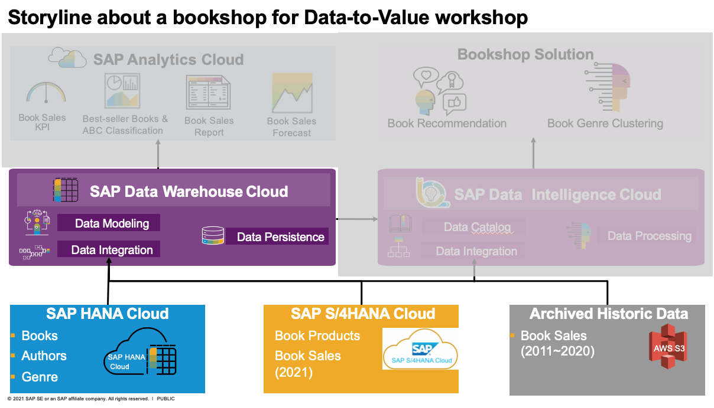
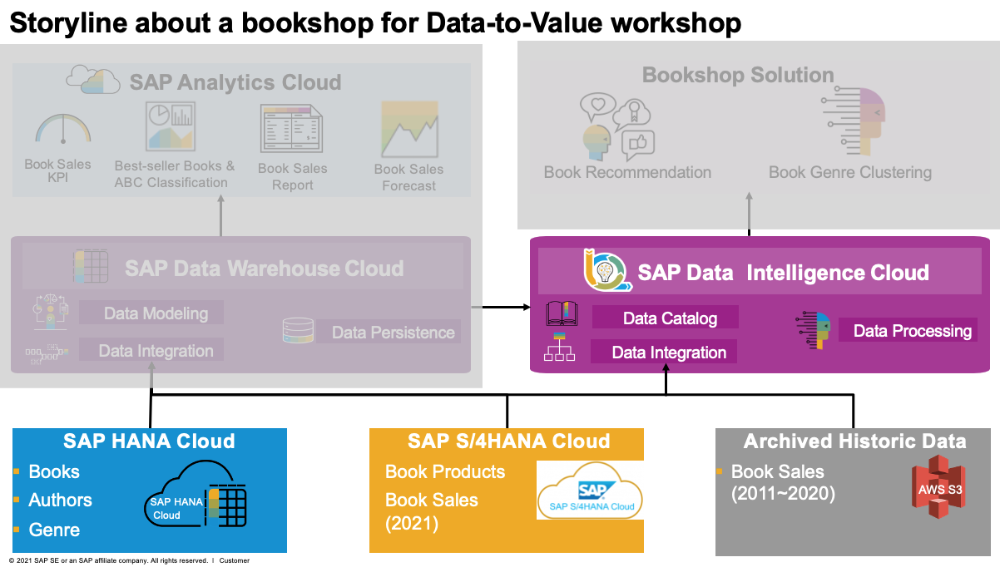

# Data Provision&Integration 
In this section, we'll perform the exercises about how to connect the following source systems to SAP Data Warehouse Cloud and SAP Data Intellgience Cloud
- SAP HANA Cloud(bookshop solution)
- SAP S/4HANA Cloud(book sales since 2021)
- AWS S3(archived historic book sales from 2011 to 2020)
 
As well as, connecting SAP Data Warehouse Cloud to SAP Data Intelligence Cloud, which will be used in the subsequent exercise DV220-Exercise01 about Book Recommendation with PAL/APL of built-in HANA Cloud Service of SAP Data Warehouse Cloud.

## DV140-Data Integration with SAP Data Warehouse Cloud

- [DV140_Exercise01](exercises/DV140_Exercise01_S4HC_DWC_Connection_Setup.pdf): Connect SAP S/4HANA Cloud to SAP Data Warehouse Cloud
- [DV140_Exercise02](exercises/DV140_Exercise02_SAPHC_DWC_Connection_Setup.pdf): Connect SAP HANA Cloud(bookshop solution) to SAP Data Warehouse Cloud
- [DV140_Exercise03](exercises/DV140_Exercise03_S3_DWC_Connection_Setup.pdf): Connect AWS S3 to SAP Data Warehouse Cloud

## DV150-Data Integration with SAP Data Intelligence Cloud

- [DV150_Exercise01](exercises/DV150_Exercise01_S4HC_DI_Connection_Setup.pdf): Connect SAP S/4HANA Cloud to SAP Data Intelligence Cloud
- [DV150_Exercise02](exercises/DV150_Exercise02_SAPHC_DI_Connection_Setup.pdf): Connect SAP HANA Cloud(bookshop solution) to SAP Data Intelligence Cloud
- [DV150_Exercise03](exercises/DV150_Exercise03_S3_DI_Connection_Setup.pdf): Connect AWS S3 to SAP Data Intelligence Cloud
- DV150_Exercise04: Connect SAP Data Warehouse Cloud to SAP Data Intelligence Cloud. This exercises is not required for the Bootcamp partcipants, which has been created by default as a DWC connection named DWC_XXXXXXXX(XXXXXX stands your assigned user id) in SAP Data Intelligence Cloud.