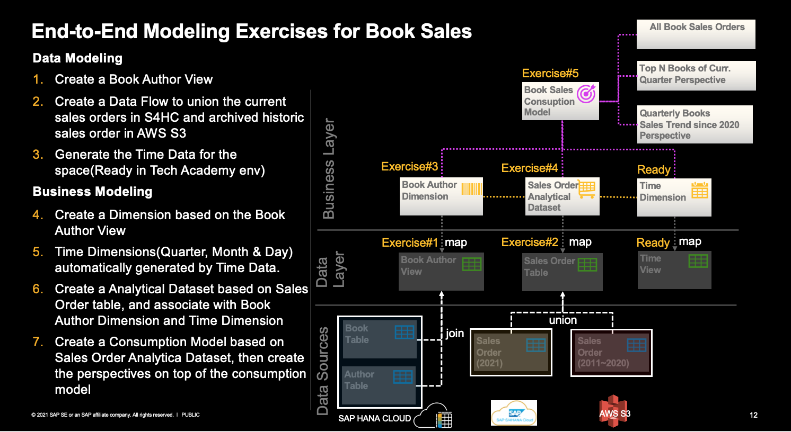
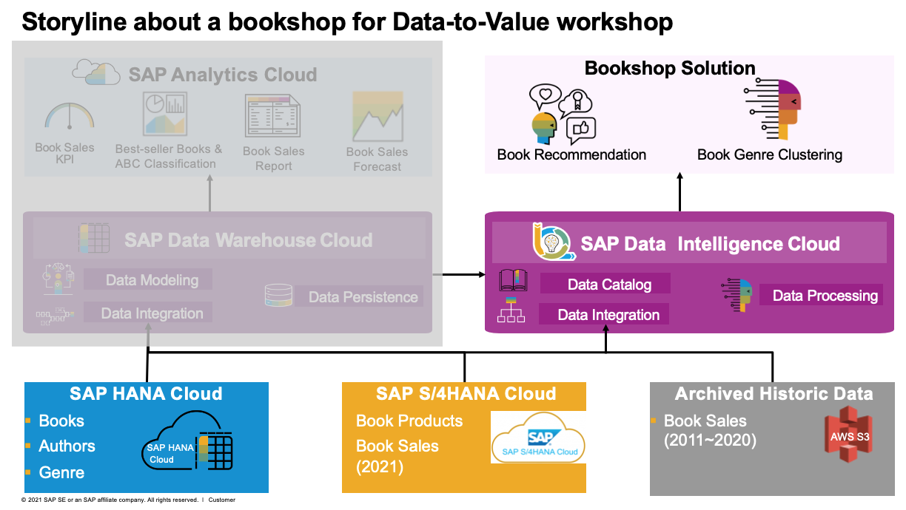

# Data Modeling&Processing
In this section, we'll perform the following exercises 
- SAP Data Warehouse Cloud Modeling for Book Sales Analysis
- End-to-end Machine Learning with SAP Data Intelligence Cloud for
    - Book Recommendation
    - Book Genre Clustering
## DV200-SAP Data Warehouse Cloud Modeling

- [DV200_Exercise01](exercises/DV200_Exercise01_Data_Builder_Graphical_View_Creation_for_Book_Author_View.pdf): Create a Book Author view with Graphical View of Data Builder
- [DV200_Exercise02](exercises/DV200_Exercise02_Data_Builder_Data_Flow_Creation_for_Book_Sales_Order.pdf): Create a Data Flow to union the current sales orders in SAP S/4HANA Cloud and archived historic sales order in AWS S3, and persist the result as a local table.
- [DV200_Exercise03](exercises/DV200_Exercise03_Business_Builder_Dimension_View_Creation_for_Book_Author_Dimension.pdf): Create a Dimension based on Book Author view
- [DV200_Exercise04](exercises/DV200_Exercise04_Business_Analytical_Dataset_Creation_for_Book_Sales_Order.pdf): Create a Analytical Dataset about All Book Sales Orders based on result of DV200_Exercise02 with association to Book Author Dimension and Day Dimension.
- [DV200_Exercise05](exercises/DV200_Exercise05_Business_ConsumptionModel_Perspective_Creation_for_Book_Sales_Order.pdf): Create a Comsumption Model based on the analytica dataset created in DV200_Exercise04, and create a perspective for the consumption model about All Book Sales Order with all fields.
- [DV200_Exercise06_Bonus_Exercise](exercises/DV200_Exercise06_Bonus_Exercise_Data_Builder_Graphical_View_Creation_for_V_BL_Sales_Dataset.pdf): This is a bonus exercise about modeling, which let you explore different options of modeling for the same use case. In this exercise, you will create another graphical view with data builder based on the book author view created in DV200_Exercise01, the time dimension-day view, and all_book_sales_order local table in DV200_Exercise02, which can produce the same output as DV200_Exercise05 for consumption.

## End-to-end Machine Learning with SAP Data Intelligence Cloud

- DV210_Exercise01: Book Recommendation with SAP HANA Machine Learning.  
**Import Note:** The original exercise is ought to leverage the built-in SAP HANA Machine Learning of SAP Data Warehouse Cloud against the local table All_Book_Sales as output of DV200_Exercise02.   However, due to the infrastructure issue, we have to fall back to use the SAP HANA Cloud for this exercise in which the bookshop solution is running, which require the participant to prepare the all the sales order item data in their own SAP HANA Cloud tenant. Therefore, the exercise flow as below: 
  - Please follow this [data preparation for bookshop solution in SAP HANA Cloud via sql](01-bookshop-hcs/sql) to create the tables(Please refer the System Access in dedicated MicroSoft Teams for SAP HANA Cloud tenant information). And then you only need to import the data for table SAP_CAPIRE_BOOKSHOP_ORDERITEMS with [sales_order_items_all.csv](../00-data-preparation/00-dataset/sales_order_items_all.csv), which is only required by this book recommendation exercise with SAP HANA machine learning
  - Perform [DV210_Exercise01](exercises/DV210_Exercise01_Book_Recommendation_with_SAP_HANA_Machine_Learning.pdf). The related Jupytor Notebook is available [here](exercises/DV210_Exercise01_Book_Recommendation.ipynb) for referene.
- [DV220_Exercise01](exercises/DV220_Exercise01_Book_Genre_Clustering_via_Text_Classification_and_Clustering_with_Python.pdf): Book Genre Clustering via Text Classification and Clustering with Python. The related Jupytor Notebook is available [here](exercises/DV220_Exercise01_Book_Genre_Clustering.ipynb) for referene.