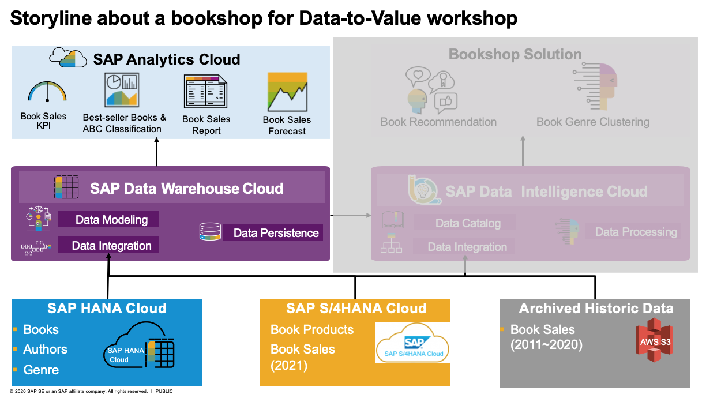

# Data Visualisation&Anlytics
In this section, we'll perform the following exercises to create a story about Bookshop Sales 360 with SAP Analytics Cloud

## DV305-Connection and Dataset Management in SAP Analytic Cloud 
- [DV305_Exercise01](exercises/DV305_Exercise01_SAC_Live_Connection_to_DWC.pdf): Create a live connection from SAP Analytics Cloud to SAP Data Warehouse Cloud for consuming the perspectives of Book Sales Consumption Model, which are the result of day 2 exercise [DV200_Exercise05](../02-data-modeling&processing/exercises/DV200_Exercise05_Business_ConsumptionModel_Perspective_Creation_for_Book_Sales_Order.pdf)
- [DV305_Exercise02](exercises/DV305_Exercise02_SAC_Data_Modeling_and_Wrangling.pdf): Create a model by acquiring dataset from [sales_order_items_all_exended.csv](../00-data-preparation/00-dataset/sales_order_items_all_exended.csv) and fill-in the missing book title with data wrangling.

## DV307-Story Design in SAP Analytic Cloud 
- [DV307_Exercise01](exercises/DV307_Exercise01_SAC_Story_Design_with_DWC_Live_Data.pdf): Create a Bookshop Sales 360 story by consuming the live data to the perspective All_Bool_Sales_Order of Book Sales Consumption Model created in [DV200_Exercise05](../02-data-modeling&processing/exercises/DV200_Exercise05_Business_ConsumptionModel_Perspective_Creation_for_Book_Sales_Order.pdf)
- [DV307_BonusExercise](exercises/DV307_BonusExcercise_SAC_Story_Design_with_Explorer.pdf): Create a Bookshop Sales 360 story by consuming the live data to the view V_BL_Book_Sales created in [DV200_Exercise06_Bonus_Exercise](../02-data-modeling&processing/exercises/DV200_Exercise06_Bonus_Exercise_Data_Builder_Graphical_View_Creation_for_V_BL_Sales_Dataset.pdf), which starts with exploring data.

## DV310-Augmented Analytics SAP Analytics Cloud
- [DV310_Exercise01](exercises/DV310_Exercise01_SearchToInsight_SmartInsight.pdf): Create a Smart Sales Insight page with Search-to-Insight and Smart Insight as part of Bookshop Sales 360 story.

## DV330-Predictive Planning with SAP Analytics Cloud
- [DV330_Exercise01](exercises/DV330_Exercise01_Book_Sales_Forecast_with_SAC_Predictive_Planning.pdf): Book Sales Forecast with Preditive Planning in SAP Analytics Cloud

## DV360-Analytic Application creation in SAP Analytics Cloud
- [DV360_Exercise01](exercises/DV360_Exercise01_AnalyticsApp.pdf): Create an Analytic Application and implement event for widgets interaction.

## License
Copyright (c) 2021 SAP SE or an SAP affiliate company. All rights reserved. This project is licensed under the Apache Software License, version 2.0 except as noted otherwise in the [LICENSE](../LICENSES/Apache-2.0.txt) file.
