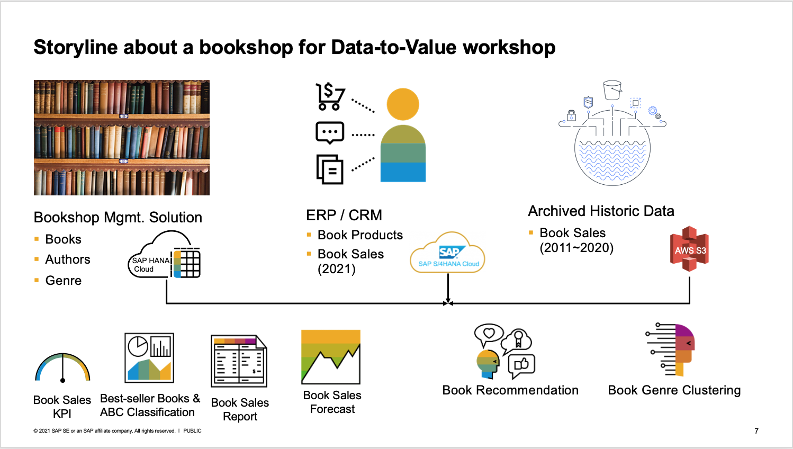
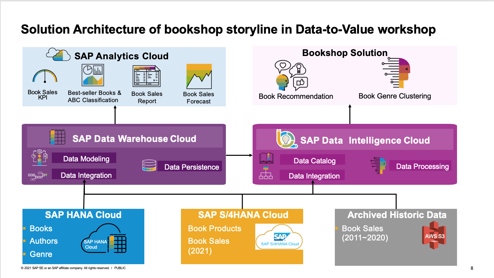
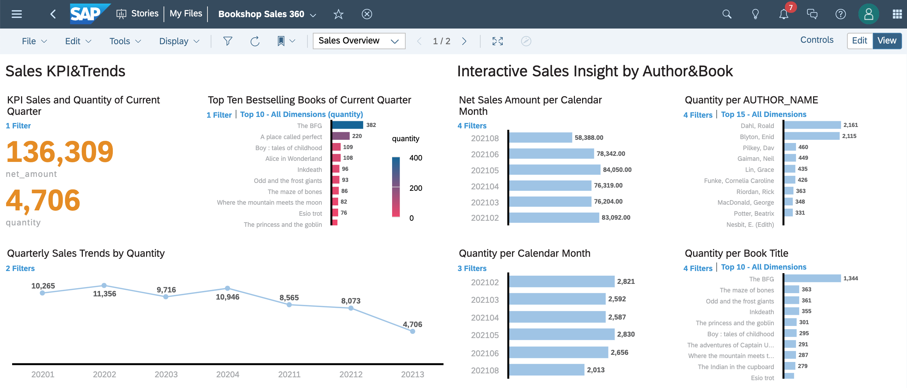
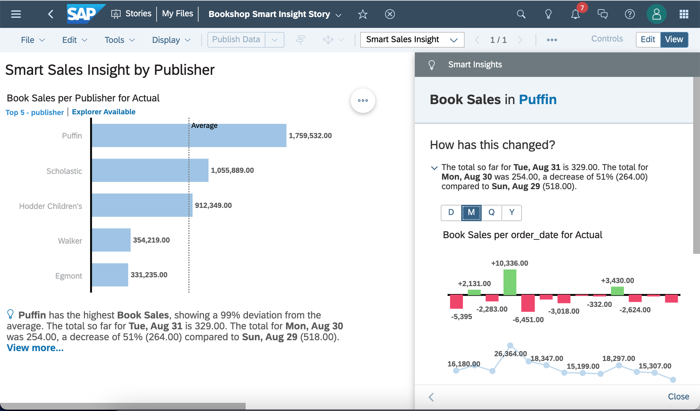
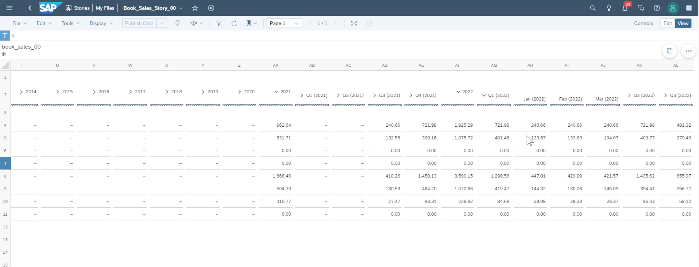

# SAP BTP Data-to-Value Bootcamp
This SAP BTP Data-to-Value Bootcamp is developed and delivered by Partner Ecosystem Success Organization (formerly known as GPO) of SAP SE, which aims to help SAP partners quickly jump started with SAP BTP for Data-to-Value journey. The bootcamp uses an end-to-end storyline about a bookshop, helping the bookshop manager to turn  data into business values with the SAP BTP solution portfolio of Database, Data Management & Analytics. 
 
 
The bootcamp series events are organized and delivered through SAP Virtual Event Services with a format of presentation, demo and exercise, which lasts 3~4 hours each day and 3 days in total. In addition, the system access of this bootcamp are prepared for the participants by SAP organizer. However, the system requirement and data preparation is also documented in this repository for those who don't attend the bootcamp, where you can build up your own system landscape to complete this bootcamp on your own with self-pace learning.
 
 
At the end of the bootcamp, a badge will be issued by SAP to those participants who have gone throughout the whole bootcamp  and completed all the exercise tasks as a recognition of achievement.
 
 
The bookshop solution is a popular [example](https://github.com/SAP-samples/cloud-cap-samples/tree/master/bookshop) of SAP Cloud Application Programing Model (CAP) about side-by-side extensibility with SAP BTP, also as an exercise of our SAP BTP Extension Suite Bootcamp.
 
 
Table of content
- [Description](#Description)
    - [Objectives](#Objectives)
    - [Agenda](#Agenda)
    - [Storyline](#Storyline)
    - [Solution Architecture](#Solution-Architecture)
    - [Final Outcomes of the Storyline](#Final-Outcomes-of-the-Storyline)
- [Requirements](#Requirements)
    - [System Access Prerequisites](#System-Access-Prerequisites) 
    - [Knowledge Prerequisites](#Knowledge-Prerequisites)
- [End-to-end Exercises Flow](#End-to-end-Exercises-Flow)
    - [00-Data Preparation](#00-Data-Preparation)
    - [01-Data Prevision&Integration](#01-Data-PrevisionIntegration)
    - [02-Data Modeling&Processing](#02-Data-ModelingProcessing)
    - [03-Data Visualisation&Analytics](#03-Data-VisualisationAnalytics)

## Description
This GitHub repository contains the dataset, exercises, and sample code for the SAP BTP Data-to-Value Bootcamp. Covering an end-to-end data-to-value process with the Database, Data management & Analytics solution portfolio of SAP Business Technology Platform such as: 
- SAP HANA Cloud Service (HCS) 
- SAP Data Warehouse Cloud (DWC)
- SAP Data Intelligence Cloud (DI)
- SAP Analytics Cloud (SAC)

### Objectives
The main objective of this bootcamp and its associated GitHub Repository here is to help you to get started with SAP Data-to-Value journey with an end-to-end storyline.

### Agenda
The agenda of this bootcamp is structured as process-oriented as below instead of product-oriented.
- Data Provisioning and Integration (HCS,DWC,DI)
- Data Modeling and Processing (DWC,DI)
- Data Visualisation and Analytics (SAC) 

### Storyline

[Bookshop Storyline Demo Video](https://www.youtube.com/watch?v=HoF25aaZRlY&list=PLUvT3ZwlN9W3iXfnhh8CW2VKxSnf3bcCc&index=1)
 
John, the owner of an online bookshop of children literature named Amilka Bookshop Ltd. base in London, as a fan of Roald Dahl since childhood back in the 80's who has a dream of owning a bookshop in neighborhood with heaps of attractive collections of children reading, has started his own online bookshop business(eCommerce) since 2011 specializing in children literature, and used a local ERP for operation. As the business grows and expands geographically, in late 2020, John has hired an SAP partner to replace the local ERP with a modern modular cloud ERP **SAP S/4HANA Cloud**, and migrate the legacy bookshop management solution to SAP HANA Cloud with SAP Cloud Application Programing Model, which has seamless integration with SAP S/4HANA Cloud. The historical book sales data from 2011 to 2020 are extracted from legacy ERP into csv files. The project has successfully gone live since beginning of 2021. Since then the book sales have been maintained in SAP S/4HANA Cloud, the book catalog and online orders are managed with the new bookshop solution.   

Now the data landscape of Amilka Bookshop Ltd. as:
- bookshop solution (books, authors, genres, etc.) in SAP HANA Cloud
- current book sales data since 2021 in SAP S/4HANA Cloud
- archived historic book sales data from 2011 to 2020 in AWS S3

As an SAP partner, through this bootcamp you’ll help John with the Data-to-Value journey to address business questions such as:
- sales KPI of current quarter
- quarterly books sales trend since 2020
- top best-selling books of 2021, and drill down by month, author and book.
- book sales forecast and planning
- book recommendation with machine learning to improve the customer purchasing experience and upsales.
- book genre clustering with machine learning to automate the book genre prediction for new books. 
- ...

### Solution Architecture
**Disclaimer:** 
The following Solution Architecture of Data-to-Value for the bookshop storyline purposely includes the completed SAP BTP solution portofilo of Database, Data Management&Analytics, namely SAP HANA Cloud, SAP Data Warehouse Cloud, SAP Data Intelligence Cloud and SAP Analytics Cloud, which is just one of many viable options to achieve the same use cases of the storyline.   
In real customer case, the journey of Data-to-Value may vary and attribute to the following key factors:
- business ojectives and requirements
    - real-time or acceptable latency
    - agility and accessibility
    - data-driven decision
    - data-driven product or service
    - augmentation and automation
    - reimagining business model
    - ...
- technical requirements and viability
    - data span: system landscape complexity
    - data type variety: structured data, semi-structured data, unstructured data etc.
    - data volume                                                      
    - data storage, data staging
    - data integration
    - data processing
    - data governance
    - data orchestration
    - ...
- economical feasibility
    - TCO(Total Cost of Ownership) 
    - ROI(Return On Investment)
    - ...

In this sample solution architecture of the bookshop storyline, it is made of:
- **SAP S/4HANA Cloud**: The books are mapped as product master data, and current books sales order since 2021 are recorded.
- **SAP HANA Cloud**: ([Demo Video](https://www.youtube.com/watch?v=C-AQRhkZJOE&list=PLUvT3ZwlN9W3iXfnhh8CW2VKxSnf3bcCc&index=2))SAP HANA DB used as a database of bookshop solution extending SAP S/4HANA Cloud in a fashion of Side-by-Side Extensibility.
- **AWS S3**: The archived historic book sales order items from 2011 to 2020 in csv format.
- **SAP Data Warehouse Cloud**: ([Demo Video](https://www.youtube.com/watch?v=HGW8kS0SgcE&list=PLUvT3ZwlN9W3iXfnhh8CW2VKxSnf3bcCc&index=3))
    - Used as a central data storage and management to integrate, transform and persist the three data sources above, modeling for Books Sales analytics. 
    - Used for Book Recommendation machine learning with PAL/APL of built-in HANA Cloud Service within SAP Data Warehouse Cloud based on the combined Books Sales Data, which is orchestrated and operationalised by SAP Data Intelligence Cloud.
- **SAP Data Intelligence Cloud**: ([Demo Video](https://www.youtube.com/watch?v=p8BXFQJyDt4&list=PLUvT3ZwlN9W3iXfnhh8CW2VKxSnf3bcCc&index=4)).End-to-end Machine Learning Orchestration and Optionisation for Book Recommendation and Book Genre Clustering. 
- **SAP Analytics Cloud**: ([Demo Video](https://www.youtube.com/watch?v=Fls06IRHUDQ&list=PLUvT3ZwlN9W3iXfnhh8CW2VKxSnf3bcCc&index=5)).Used for data virtualisation and anltyics of bookshop, such as       
    - Bookshop Sales 360 with a live connection to SAP Data Warehouse Cloud's consumption model and perspctives
        - Book Sales KPI of current Quarter, 
        - Quarterly Book Sales Trend since 2020, 
        - Interactive Sales Insight by Month/Book/Author, 
        - Montly Book Sales Report etc. 
    - Book Sales Forecast with Predictive Planning.
    - ...

### Final Outcomes of the Storyline
#### Bookshop Sales 360

#### Smart Sales Insight  

#### Book Sales Forecast with Preditive Planning

## Requirements
### System Access Prerequisites
**Impportant Note**: No action required here for the participants attending SAP Data-to-Value bootcamp.  
The following system access prerequisites only apply to the self-pace learning without attending the BTP Data-to-Value bootcamp series organized by the Partner Ecosystem Success organization of SAP, in which all these system accesses are prepared and communicated by SAP to the participants who attend the bootcamp.
- An SAP HANA Cloud instance (trial version is fine) for bookshop solution
    - Provision a SAP HANA Database instance of SAP HANA Cloud Service used by the bookshop solution. Required by self-pace learning without attending the bootcamp, which has been prepared with Technical Academy Environment
    - Obtain the SAP HANA Database Explorer URL, HANA Database User and Password to the target SAP HANA Cloud Service through you SAP HANA Cloud central.
- An SAP S/4HANA Cloud tenant for book products and active sales orders of books since 2021
- An AWS S3 bucket for archived historic book sales orders from 2011 to 2020
- An SAP Data Warehouse Cloud tenant. (Trial version almost fine execpt no Machine Learning enabled for the built-in SAP HANA Cloud service,therefore you won't be able to perform Book Recommendation execise with DWC trial.)
- An SAP Data Intelligence Cloud tenant (Trial version is fine)
- An SAP Analytics Cloud tenant (Trial version is fine)

### Knowledge Prerequisites
For the day two of the bootcamp, it will cover two machine learning scenarios, 
- book recommendation with SAP HANA Machine Learning 
- book genre clustering with sklearn in Python Machine Learning. 

Therefore, in order to have an effective learning, before day two the participants should teach themselves with this openSAP course about [Get Started with Data Science (Edition 2021)](https://open.sap.com/courses/ds3) if you don't have a data scicense background.

## End-to-end Exercises Flow
This section describes the end-to-end flow of exercises. Please click each for detail.
### [00-Data Preparation](00-data-preparation)
Here you find the dataset details and steps to prepare the data on own for self-pace learning. 
No action required for the bootcamp participants, for all the data have been prepared by SAP.
### [01-Data Prevision&Integration](01-data-provision&integration)
Here you will perform the exercises about how to connect the following source systems in the storyline to SAP Data Warehouse Cloud and SAP Data Intellgience Cloud
- SAP HANA Cloud(bookshop solution)
- SAP S/4HANA Cloud(book sales since 2021)
- AWS S3(archived historic book sales from 2011 to 2020)
### [02-Data Modeling&Processing](02-data-modeling&processing)
in this section, you will perform the exercises to 
- Create an end-to-end Book Sales Analysis Consumption Model with data builder and business builder of SAP Data Warehouse Cloud.
- Create a Book Recommendation machine learning model with Jupyter notebook using Market Analysis Association in SAP HANA Machine Learning(PAL/APL), and operationalise the model training and inference with pipeline in SAP Data Intelligence Cloud.
- Create a Book Genre machine learning model with Jupyter notebook using sklearn, and operationalise the model training and inference with pipeline in SAP Data Intelligence Cloud.
### [03-Data Visualisation&Analytics](03-data-visualisation&analytics)
Here you will perform the exercises to 
- Create a live connection to SAP Data Warehouse Cloud in SAC
- Create a dataset by uploading a CSV file
- Create a Story about Bookshop Sales 360 based on the perspective All_Bool_Sales_Order of Book Sales Consumption Model with the live connection to SAP Data Warehouse Cloud
- Add a story page for Sales Insight by publisher with Search to Insight and Smart insight
- Create a planning model by uploading a CSV file
- Create a book sales forecast with predictive planning.

## How to obtain support
For the bootcamp participants, please use the dedicated MicroSoft Teams Channel for Q&A. 
For the self-pace learning without attending the bootcamp, please [Create an issue](https://github.com/SAP-samples/<repository-name>/issues) in this repository if you find a bug or have questions about the content.

For additional support, [ask a question in SAP Community](https://answers.sap.com/questions/ask.html).

## License
Copyright (c) 2021 SAP SE or an SAP affiliate company. All rights reserved. This project is licensed under the Apache Software License, version 2.0 except as noted otherwise in the [LICENSE](LICENSES/Apache-2.0.txt) file.